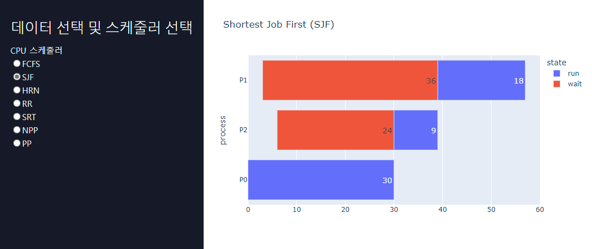
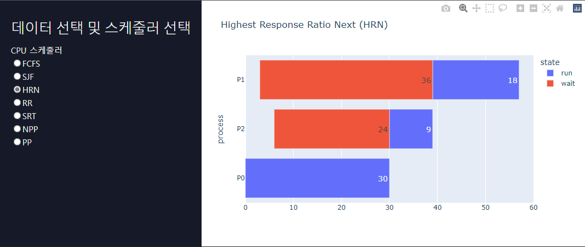
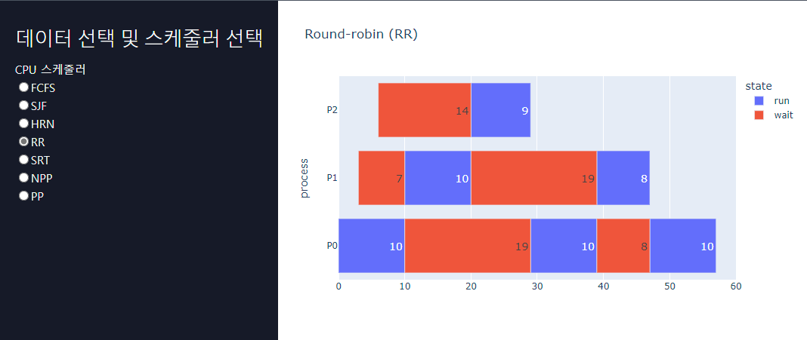
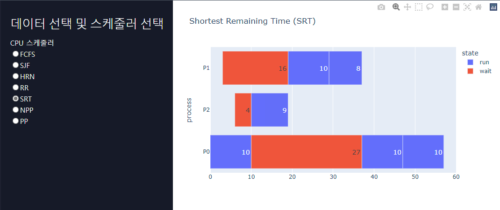
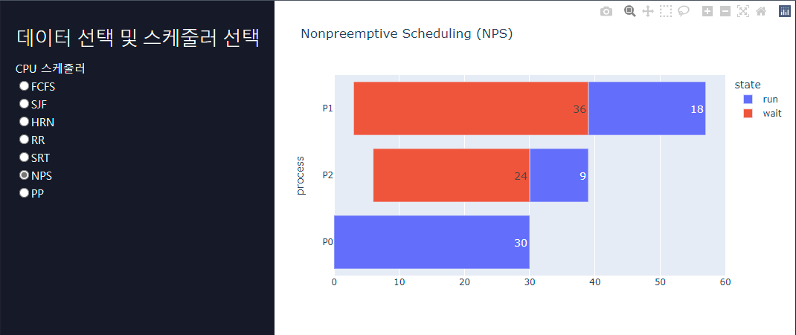
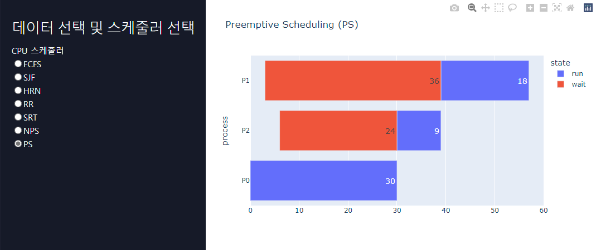

# 운영 체제 CPU 스케줄링 프로젝트

---

### 정보
운영체제 과목을 수강하면서 제작한 CPU 스케줄링 모니터링 어플리케이션 입니다!

## CPU 스케줄러 알고리즘 APP UI

- First Come First Served : FCFS
 
준비큐에 도착한 순서대로 CPU를 할당하는 비선점형 방식으로, 선입선출 스케줄링이라 부릅니다.

 

- Shortest Job First : SJF
 
준비큐에 있는 프로세스 중에서 실행 시간이 가장 짧은 작업부터 CPU에 할당하는 비선점형 방식으로, 최단 작업 우선 스케줄링이라 부릅니다.

 

- Highest Response Ratio Next : HRN
 
SJF 스케줄링에서 발생할 수 있는 아사 현상을 해결하기 위해 만들어진 비선점형 알고리즘으로, 최고 응답률 우선 스케줄링이라 부릅니다.

 

- Round-robin : RR
 
프로세스가 할당 받은 시간 ( 타임 슬라이스 ) 동안 작업을 하다가 작업을 완료하지 못하면 준비 큐의 맨 뒤로 가서 자기 차례를 기다 리는 방식입니다.

 

  
- Shortest Remaining Time : SRT
 
SJF 스케줄링과 라운드 로빈 스케줄링을 혼합한 방식으로, 최소 잔류 시간 우선 스케줄링이라고 합니다.

 

- Nonpreemptive Scheduling : NPS
 
비선점 스케쥴링(Non-preemptive Scheduling)은 프로세스가 자원을 할당 받았을 경우 자원을 스스로 반납할 때까지 계속 그 자원을 사용하도록 허용하는 정책입니다.

 

- Preemptive Scheduling : PS
 
선점 스케줄링(Preemptive Scheduling)은 하나의 프로세스가 CPU를 점유하고 있을 때 다른 프로세스가 CPU를 빼앗아 차지 할 수 있는 방법입니다.

 

